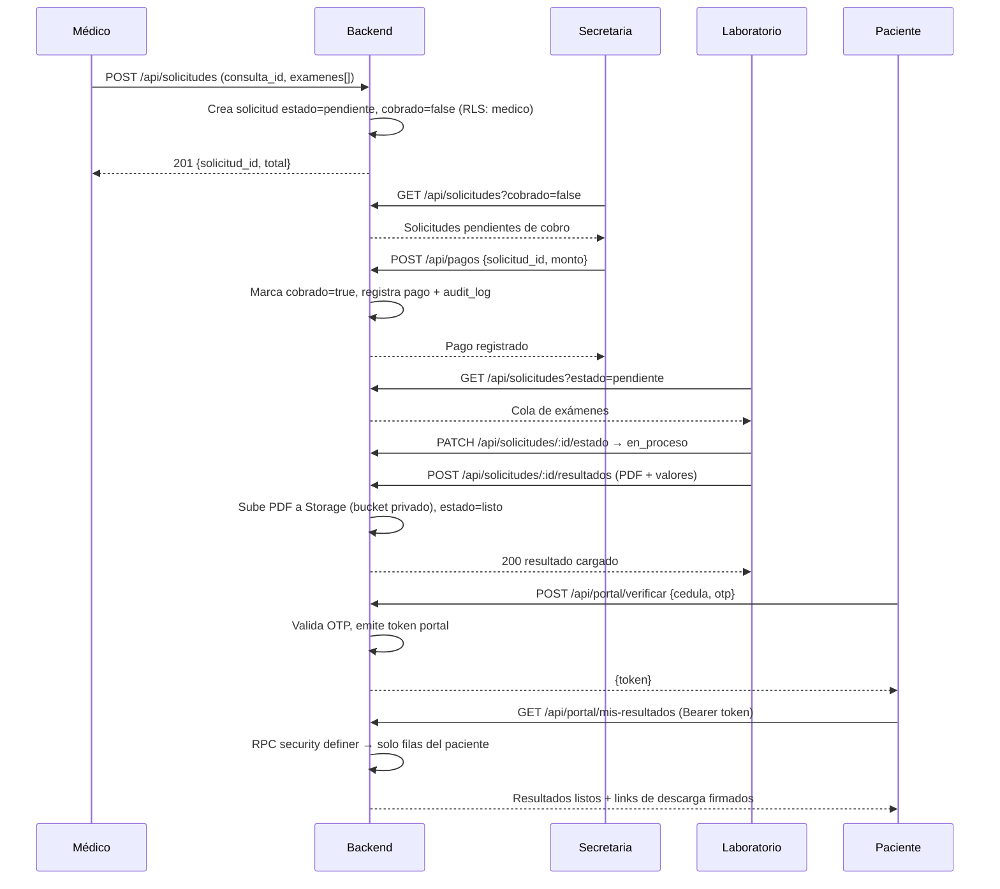

# SPEC — TotalHealth

Plataforma de salud digital integrada: consultas médicas, laboratorio clínico e historial médico.
Backend unificado + Frontend único híbrido/responsive (Web + Móvil PWA).

**Stack definido:**

| Capa | Tecnología | Justificación |
|---|---|---|
| Backend | Node.js + **Express** (modular) | Menor curva de despliegue; estructura por módulos escala sin el boilerplate de Nest. (NestJS es alternativa si se prioriza DI/inyección.) |
| Frontend | React.js + TailwindCSS | Componentes reutilizables, mobile-first, PWA. |
| Base de datos | Supabase (PostgreSQL) | Auth integrado + RLS para cumplimiento de seguridad médica. |
| Estado | Zustand + TanStack Query | Estado de sesión/rol ligero + caché de servidor. |

---

## Parte 1 — Arquitectura de la Solución Backend (Node.js + Supabase)

### 1.1 Estructura de la Base de Datos (PostgreSQL)

Convenciones: UUID (`gen_random_uuid()`), timestamps `created_at/updated_at`, soft-delete con `deleted_at` en entidades médicas. Enum por estado.

```sql
-- Enums
CREATE TYPE rol AS ENUM ('super_root', 'admin', 'medico', 'laboratorio', 'secretaria');
CREATE TYPE estado_consulta AS ENUM ('programada', 'en_curso', 'completada', 'cancelada');
CREATE TYPE estado_solicitud AS ENUM ('pendiente', 'en_proceso', 'listo', 'entregado');
CREATE TYPE estado_pago AS ENUM ('pendiente', 'pagado', 'reembolsado');
CREATE TYPE estado_recipe AS ENUM ('activo', 'cancelado', 'expirado');
CREATE TYPE tipo_pago AS ENUM ('consulta', 'laboratorio');
```

**Tablas núcleo**

| Tabla | Columnas clave | Notas |
|---|---|---|
| `auth.users` | (integrada) `id, email, phone` | No se modifica. |
| `clinicas` | `id, nombre, rif, direccion, telefono, config jsonb` | `config`: precios por defecto, parámetros. |
| `profiles` | `id (PK, FK→auth.users), role rol, roles rol[], email, nombre_completo, cedula, telefono, clinica_id FK, activo bool` | Un registro por usuario autenticado. `roles` son los roles asignados por el admin (uno o varios); `role` es el rol activo de la sesión. |
| `pacientes` | `id, cedula (UQ), nombre_completo, fecha_nacimiento, telefono, email, direccion, sexo, clinica_id, fecha_consentimiento` | `cedula` en formato `V-12345678` / `E-12345678`. |
| `consultas` | `id, paciente_id FK, medico_id FK(profiles), clinica_id, fecha_hora, motivo, diagnostico text, estado estado_consulta, notas` | Historial clínico por paciente. |
| `examenes_laboratorio` | `id, nombre, categoria, precio numeric, interno bool, duracion_min, activo` | Catálogo administrado por Admin. |
| `solicitudes` | `id, consulta_id FK, paciente_id FK, medico_id FK, fecha, estado estado_solicitud, cobrado bool, nota` | Orden médica. |
| `solicitudes_detalle` | `id, solicitud_id FK, examen_id FK, resultado_id FK NULL, precio numeric` | Línea por examen. |
| `resultados` | `id, solicitud_detalle_id FK, bioanalista_id FK(profiles), valores jsonb, pdf_path text, observaciones, procesado_at` | `pdf_path` → Storage bucket privado. |
| `recipes` | `id, consulta_id FK, paciente_id FK, medico_id FK, fecha_emision, fecha_expiracion, estado estado_recipe` | |
| `recipes_detalle` | `id, recipe_id FK, medicamento, presentacion, dosis, frecuencia, indicaciones, duracion` | |
| `pagos` | `id, tipo tipo_pago, solicitud_id FK NULL, consulta_id FK NULL, paciente_id FK, monto numeric, metodo, secretaria_id FK, fecha, estado estado_pago` | |
| `reactivos` | `id, nombre, lote, fecha_vencimiento, cantidad, alerta_minima, proveedor` | |
| `portal_codigos` | `id, paciente_id FK, codigo_hash, expira_at, consumido bool` | OTP de consulta pública. |
| `audit_logs` | `id, usuario_id FK NULL, accion, tabla, registro_id, detalles jsonb, ip, fecha` | Append-only. |

**Índices obligatorios:** `pacientes(cedula)`, `consultas(paciente_id, fecha_hora)`, `consultas(medico_id)`, `solicitudes(estado, fecha)`, `resultados(solicitud_detalle_id)`, `recipes(paciente_id)`, `audit_logs(fecha)`.

### 1.2 Políticas RLS de Supabase

Principio: cada rol ve solo su dominio. Se aplican como políticas en PostgreSQL y se habilitan en todas las tablas médicas.

| Tabla | Política | Regla lógica |
|---|---|---|
| `profiles` | SELECT/UPDATE | Usuario ve/edita su perfil; Admin ve/edita personal de su `clinica_id`. |
| `pacientes` | SELECT/INSERT/UPDATE | `super_root/admin/secretaria` CRUD. `medico`: SELECT global (lectura del expediente de cualquier paciente, sin importar quién lo atendió). |
| `consultas` | SELECT/INSERT/UPDATE | `medico`: solo `medico_id = auth.uid()`. `secretaria`: SELECT para agenda. |
| `solicitudes` | SELECT/UPDATE | `medico`: solo las propias. `laboratorio`: SELECT todas de su clínica, UPDATE solo `estado` y `nota`. |
| `resultados` | INSERT/UPDATE | `laboratorio` de la clínica. SELECT nunca expuesto al público vía tabla: se usa RPC. |
| `recipes` | SELECT/INSERT/UPDATE | `medico` autor solo. |
| `pagos` | INSERT/SELECT | `secretaria` inserta y consulta; `admin` consulta reportería. |
| `reactivos` | CRUD | `laboratorio/admin`. |
| `audit_logs` | SELECT/INSERT | INSERT por trigger; SELECT solo `super_root/admin`. |

**Portal público:** los pacientes NO son usuarios autenticados. El acceso a resultados/recipes se hace exclusivamente mediante **funciones RPC `security definer`** que validan la sesión del portal (token de corta vida) y solo devuelven filas del paciente cuyo `id` está firmado en el token. Las tablas no tienen política de acceso para `anon`.

- `verificar_paciente(p_cedula, p_codigo)` → valida OTP, consume el código, emite token de portal.
- `mis_resultados(p_token)` / `mis_recipes(p_token)` / `mis_consultas(p_token)` → datos del paciente autenticado en el portal.
- `url_descarga_resultado(p_token, p_resultado_id)` → URL firmada (Supabase Storage) de máximo 15 min.

### 1.3 Estructura de Carpetas del Backend

```
backend/
├── src/
│   ├── config/               # env.ts, supabaseClient.ts, storage.ts
│   ├── middleware/           # authGuard.ts, rbacGuard.ts, validate.ts, rateLimit.ts, errorHandler.ts
│   ├── modules/
│   │   ├── auth/             # login, refresh, registro de staff
│   │   ├── pacientes/        # CRUD pacientes
│   │   ├── consultas/        # agenda, historial, diagnóstico
│   │   ├── recipes/          # emisión/consulta de recetas
│   │   ├── solicitudes/      # órdenes de exámenes
│   │   ├── laboratorio/      # estatus, resultados, PDFs, reactivos
│   │   ├── pagos/            # cobros y reportería
│   │   ├── portal/           # consulta pública por cédula + OTP
│   │   └── admin/            # personal, catálogo, config clínica
│   ├── services/             # lógica de negocio pura (reglas médicas/fiscales)
│   ├── repositories/         # acceso a Supabase/RLS por dominio
│   ├── validators/           # zod: schemas por endpoint
│   ├── utils/                # otp.ts, jwt.ts, formatters, logger
│   ├── routes/               # index.ts que monta cada módulo
│   ├── app.ts
│   └── server.ts
├── supabase/
│   ├── migrations/           # 0001_schema.sql, 0002_rls.sql, 0003_rpc.sql
│   └── seed.sql
├── tests/                    # unit + integración (supertest)
└── package.json
```

Regla de dependencia: `routes → modules → services → repositories → Supabase`. Los controllers no tocan SQL directamente.

### 1.4 Endpoints Principales (API REST)

**Auth (envuelve Supabase Auth)**
- `POST /api/auth/login` → `{cedula, password}` → session. La cédula resuelve al email del `profile` y se valida contra Supabase Auth. El access token lleva el rol activo.
- `POST /api/auth/switch-role` → `{role}` → nuevo access token con el rol activo seleccionado (solo si está en `profiles.roles`). Cambio de rol sin volver a iniciar sesión.
- `POST /api/auth/refresh`
- `POST /api/auth/logout`

**Admin / Personal** (el admin asigna **uno o varios roles** a cada perfil)
- `POST /api/admin/staff` — Admin crea médico/secretaria/bioanalista (invita a Supabase Auth + crea `profiles`) con `roles[]`
- `GET /api/admin/staff` · `PATCH /api/admin/staff/:id` — activar/desactivar, cambiar `roles[]` (el rol activo pasa a ser el primero)
- `PUT /api/admin/examenes` — catálogo y precios
- `GET /api/admin/reporteria?desde=&hasta=` — financiero por rango
- `GET /api/admin/auditoria`

**Pacientes**
- `POST /api/pacientes` — registro inicial (secretaria)
- `GET /api/pacientes?q=cedula|nombre` — búsqueda
- `GET /api/pacientes/:id` — ficha + historial resumido
- `PUT /api/pacientes/:id`

**Consultas**
- `GET /api/consultas?medico=&fecha=` — agenda del día
- `POST /api/consultas` — programar/atender
- `GET /api/consultas/:id` — detalle + historial
- `PATCH /api/consultas/:id/diagnostico`
- `GET /api/consultas/:id/historial` — historial clínico del paciente (requiere consentimiento previo)

**Exámenes / Laboratorio**
- `GET /api/examenes` — catálogo activo
- `POST /api/solicitudes` — médico ordena exámenes de una consulta
- `GET /api/solicitudes?estado=` — cola del laboratorio
- `PATCH /api/solicitudes/:id/estado` — `pendiente|en_proceso|listo`
- `POST /api/solicitudes/:id/resultados` — subir PDF + valores (multipart)
- `GET /api/solicitudes/:id/resultados`
- `GET/POST/PATCH /api/reactivos`

**Recipes**
- `POST /api/consultas/:id/recipes`
- `GET /api/recipes/:id`
- `PATCH /api/recipes/:id/estado`

**Pagos**
- `POST /api/pagos` — cobro de laboratorio (asocia a solicitud)
- `GET /api/pagos?desde=&hasta=`

**Portal Público (paciente por cédula)**
- `POST /api/portal/verificar` → `{cedula, codigo_otp}` → `{token, paciente}`
- `GET /api/portal/mis-resultados`
- `GET /api/portal/mis-recipes` (activos/imprimibles)
- `GET /api/portal/mis-consultas`
- `GET /api/portal/resultado/:id/descargar` → redirect a URL firmada

**Mecanismo de validación OTP:** al ingresar cédula, se genera código de 6 dígitos (expira en 5 min, hash en `portal_codigos`, reintentos limitados + rate limit por IP/cédula) y se envía por SMS/WhatsApp al teléfono registrado. Fallback alternativo configurable: validación por fecha de nacimiento. Todos los intentos se registran en `audit_logs`.

---

## Parte 2 — Arquitectura de la Solución Frontend (React.js)

### 2.1 Estructura de Carpetas

```
frontend/
├── src/
│   ├── layouts/
│   │   ├── AuthLayout.tsx        # login
│   │   ├── StaffLayout.tsx       # shell con sidebar por rol
│   │   │   ├── AdminSidebar / DoctorSidebar / LabSidebar / StaffSidebar
│   │   └── PortalLayout.tsx      # consulta pública (sin login)
│   ├── components/
│   │   ├── ui/                   # Button, Card, Modal, Input, Table, Badge, Toast, Drawer
│   │   ├── forms/                # PatientForm, ExamOrderForm, ResultForm
│   │   └── feature/              # StatusBadge, ResultCard, RecipeCard, AgendaGrid, ResultUploader
│   ├── features/
│   │   ├── auth/                 # LoginPage, useSession
│   │   ├── pacientes/            # RegisterPatient, SearchPatient, PatientFile
│   │   ├── consultas/            # Agenda, NuevaConsulta, HistoriaClinica
│   │   ├── recipes/              # RecetaForm, RecetaView (imprimible)
│   │   ├── laboratorio/          # ColaDeExamenes, CargarResultado, Reactivos
│   │   ├── pagos/                # Caja, ReportePagos
│   │   ├── admin/                # GestionPersonal, CatalogoExamenes, Auditoria
│   │   └── portal/               # ConsultaPorCedula, MisResultados, MisRecipes
│   ├── hooks/                    # useAuth, useRbac, useMediaQuery
│   ├── stores/                   # sessionStore.ts (Zustand)
│   ├── api/                      # supabaseClient.ts, http.ts, query.ts (TanStack Query)
│   ├── lib/                      # rbac.ts (matriz de permisos), utils, format.ts
│   ├── router/                   # rutas protegidas por rol + guard
│   ├── styles/                   # tailwind, theme tokens
│   └── types/                    # DTOs compartidos
├── public/                       # manifest.webmanifest, sw.js, iconos
└── package.json
```

**Matriz de rutas por rol** (`lib/rbac.ts`): cada layout renderiza solo los items del módulo que el rol puede ver (misma matriz que RLS del backend).

### 2.2 Estrategia Responsive (Web + Móvil gama media)

- **Mobile-first**: base `sm`, refuerzos `md/lg`. Todo lo crítico (carga de resultados, agenda, triaje) funciona desde ~360px.
- **Tabla → Cards**: componente `DataTable` que en pantallas < `md` convierte filas en tarjetas apiladas (ideal para laboratorio y caja).
- **Navegación**: sidebar en escritorio; en móvil, bottom-nav fijo con 4 accesos (Agenda, Laboratorio, Caja, Más) y Drawer para el resto.
- **Touch-first**: objetivos táctiles ≥ 44px, botones primarios grandes para bioanalistas con guantes; estados de carga (`skeleton`) y feedback (`Toast`) claros.
- **PWA**: `manifest` + Service Worker (caché de shell y de activos; los PDFs nunca se cachean). Offline básico de la app shell.
- **Rendimiento en gama media**: `code-splitting` por ruta, `lazy()` en features pesados, evitar re-renders con selectores de Zustand, imágenes optimizadas y fuentes locales.
- **Impresión**: media query `print` para receta y resultados (vista limpia, sin nav).

### 2.3 Gestión de Estado

- **Zustand (`sessionStore`)**: `{session, profile}` persistido en `localStorage`. `profile.roles` son los roles asignados; `profile.role` es el **rol activo** de la sesión. En el login, si hay varios roles se ofrece un selector de perfil y el cambio de rol activo usa `switch-role`. Es la fuente de verdad para el RBAC del frontend (rutas, sidebar, botones).
- **TanStack Query**: todo estado de servidor (pacientes, agenda, solicitudes, resultados). Caché, `invalidateQueries` tras mutaciones (ej. laboratorio sube resultado → cola se actualiza), retry y loading states.
- **Context API**: solo para UI efímera (tema, toasts). No se usa para datos.
- **Formularios**: React Hook Form + Zod (schemas compartidos conceptualmente con los validators del backend).

---

## Parte 3 — Flujos de Trabajo Clave (Workflows)

### 3.1 "Médico ordena examen → Secretaria cobra → Laboratorio procesa → Paciente descarga"



**Eventos de negocio:** la cola del laboratorio se refresca por `invalidateQueries` tras cada cambio de estado; el cambio a `listo` dispara notificación (opcional) al teléfono del paciente cuando la configuración de la clínica lo permita.

### 3.2 Flujo de Receta Digital

1. Médico completa consulta → `POST /api/consultas/:id/recipes`.
2. Backend crea `recipes` (estado `activo`) + `recipes_detalle`.
3. Paciente imprime desde el portal (`GET /api/portal/mis-recipes`) o en pantalla con layout de impresión.
4. Récipes expiran automáticamente según `fecha_expiracion` (job programado o cálculo en query).

### 3.3 Alta de Paciente (Secretaria)

1. `POST /api/pacientes` valida formato de cédula (`V-`/`E-`) y unicidad.
2. Se registra consentimiento inicial de consulta (`fecha_consentimiento`).
3. Secretaria agenda cita → `POST /api/consultas`.

---

## 4. Seguridad y Cumplimiento (HIPAA/HL7)

- **Cifrado en tránsito** (TLS) y en reposo; PDFs solo en bucket privado con URLs firmadas temporales.
- **RLS por defecto** en todas las tablas médicas; los RPC del portal son `security definer` y acotan estrictamente por `id_paciente`.
- **Auditoría** de accesos, cambios de estado, intentos OTP y descargas de resultados en `audit_logs`.
- **Minimización de datos**: el portal público solo expone resultados, recetas activas y resumen de consultas — nunca datos de facturación ni historial completo.
- **Buenas prácticas HL7**: mapear códigos de exámenes (LOINC) y campos de historia clínica hacia un modelo interoperable en el futuro.

## 5. Variables de Entorno (Backend)

```
PORT=4000
SUPABASE_URL=https://<proyecto>.supabase.co
SUPABASE_SERVICE_ROLE_KEY=<clave_servicio_restricta>
JWT_PUBLIC_KEY=<clave_supabase_auth>
OTP_TTL_MIN=5
OTP_MAX_INTENTOS=5
STORAGE_RESULTADOS_BUCKET=resultados
SMS_PROVIDER_KEY=<twilio/whatsapp>
```

## 6. Entregables / Roadmap

1. **M1 — Cimientos**: migraciones SQL + RLS, Auth/RBAC (login por cédula), layouts por rol (multirol con selector de perfil), login.
2. **M2 — Pacientes y Consultas**: CRUD paciente, agenda, historia clínica, recetas.
3. **M3 — Laboratorio**: solicitudes, cola, resultados PDF, reactivos, pagos.
4. **M4 — Portal público**: OTP por cédula, descargas, imprimibles.
5. **M5 — Admin y endurecimiento**: reportería, auditoría, PWA, performance.
